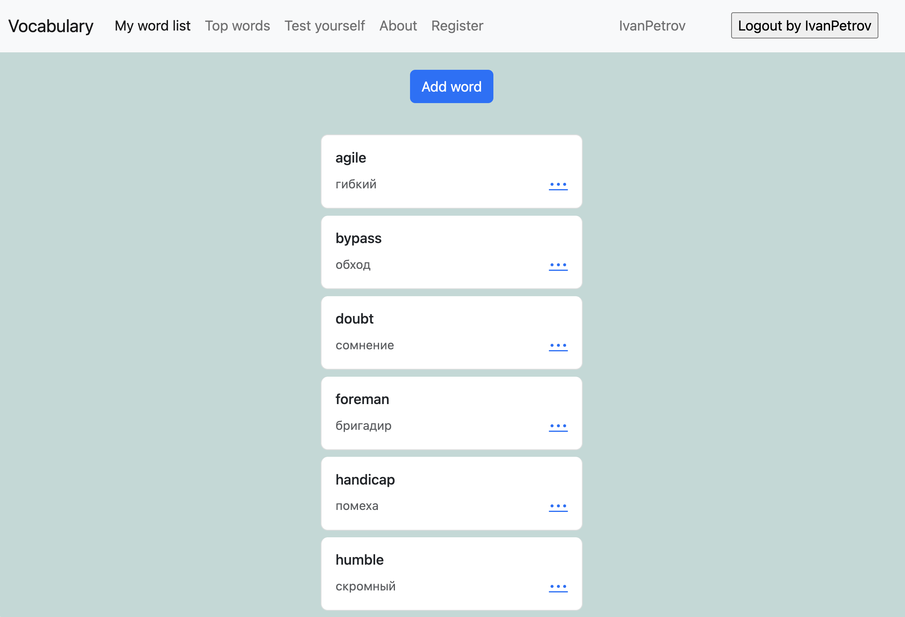
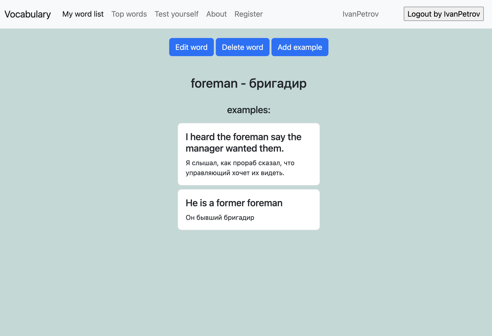
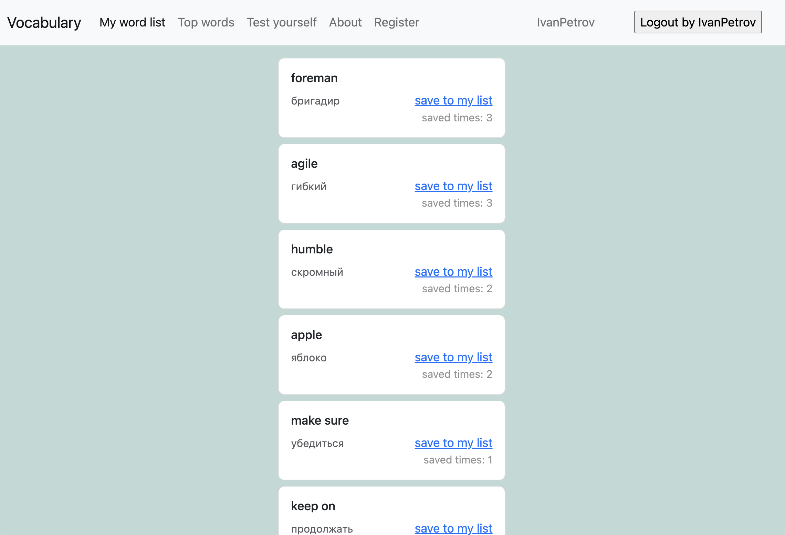
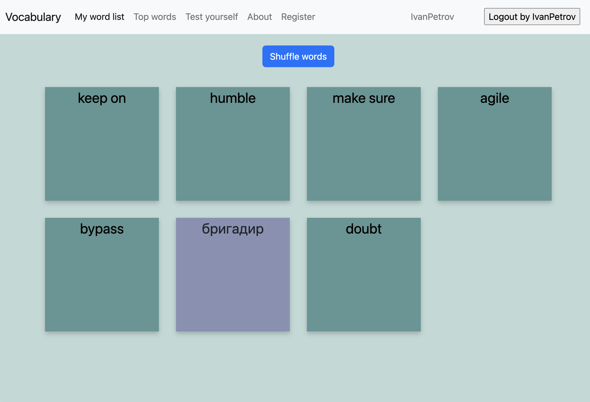

# Vocabulary
### Учебный проект
Приложение дает возможность пользователям вести словарь иностранной лексики

#### Основная функциональность:
- Регистрация, логин и разлогин пользователя
- Добавление, редактирование и удаление пары слово - перевод
- Просмотр текущего списка сохраненных слов
- Добавление примеров использования конкретного слова
- Просмотр примеров для слова
- Просмотр списка самых популярных слов среди всех пользователей
- Возможность сохранения слова из топ-списка в свою коллекцию
- Отображение слов в виде переворачивающихся карточек для самопроверки

#### Используемые технологии:
- Django (ORM, Class Based views, User)
- HTML, CSS, Bootstrap
- SQLite, SQL

#### Скриншоты:
 

 

 

 

